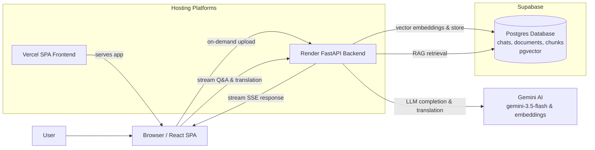

# PaperCraft Architecture

## Overview

PaperCraft is an intelligent document Q&A assistant and multi-lingual translator. It enables users to upload custom documents (`.pdf`, `.txt`, `.md`), retrieve information, ask questions, and translate responses into 8+ languages.

---

## High-Level System Architecture

---

## Architectural Principles

1. **Fast On-Demand Parsing**: Files uploaded by users are processed in real time, chunked, and converted into 1536-dimensional vector embeddings stored in Supabase `pgvector`.
2. **Hybrid RAG Retrieval Engine**: Combines cosine similarity vector search on `pgvector` with Postgres full-text search, re-ranked using Reciprocal Rank Fusion (RRF).
3. **High-Performance Streaming**: Uses HTTP Server-Sent Events (SSE) to stream answer deltas smoothly to the React UI.
4. **Live Translation Service**: Translates AI responses on demand into 8+ target languages using Gemini AI, preserving Markdown formatting and code blocks.
